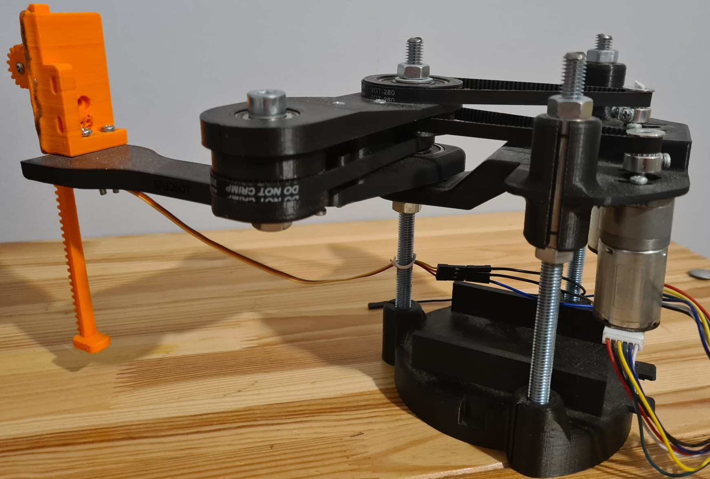
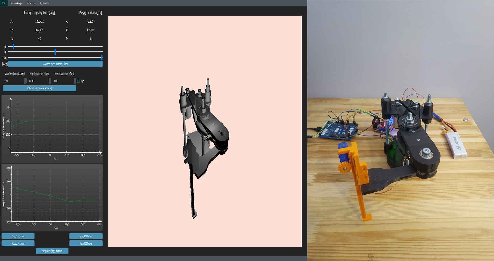

# SCARA-PROJECT
# SCARA(GNIOBOT) - DIY manipulator o trzech stopniach swobody typu SCARA :robot:

# Główne cechy projektu
## W ramach projektu zrealizowano następujące zadania:
- [X] Stworzenie trójwymiarowego modelu robota
- [X] Wykonanie modelu 3D manipulatora, gotowego pod druk 3D
- [X] Skonstruowanie manipulatora
- [X] Zaprojektowanie i wykonanie elektroniki niezbędnej do zasilania i sterowania podzespołów
- [X] Wyprowadzenie modelu kinematyki prostej i odwrotnej dla robota typu SCARA
- [X] Wykonanie programu sterującego na mikrokontroler STM32
- [X] Stworzenie aplikacji okienkowej umożliwiającej sterowanie i obserwację położenia robota

# Aplikacja okienkowa QT
## Aplikacja pozwala na:
- [X] Sterowanie manipulatorem z wykorzystaniem kinematyki prostej oraz odwrotnej
- [X] Obserwację położenia efektora i konfiguracji przegubów
- [X] Obserwację danych sensorycznych na dedykowanych wykresach
- [X] Obserwację rzeczywistego położenia manipulatora w przestrzeni za pomocą wizuacji modelu 3D manipulatora
- [X] Tworzenie sekwencji złożonej z wcześniej zaprogramowanych przez użytkownika pozycji
- [X] Rysowanie prostych kształtów takich jak linie proste oraz okręgi 

Oprogramowanie aplikacji sterującej robotem zostało opartę na moim poprzednim projekcie
https://github.com/AdamKubiak/WDS_Qt3D

## Features
- [X] DIY energy pack
- [X] WiFi connection
- [X] PID motor power controler
- [X] RoboVision integration
- [X] Circuit board design
- [X] Chassis design

## PCB
