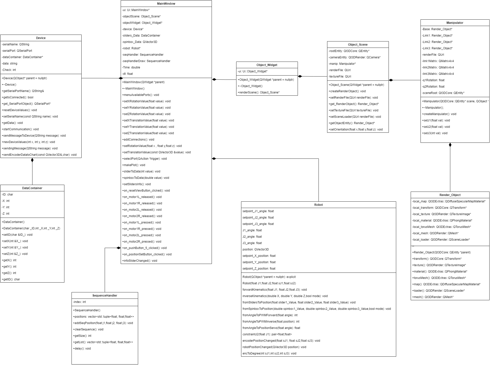
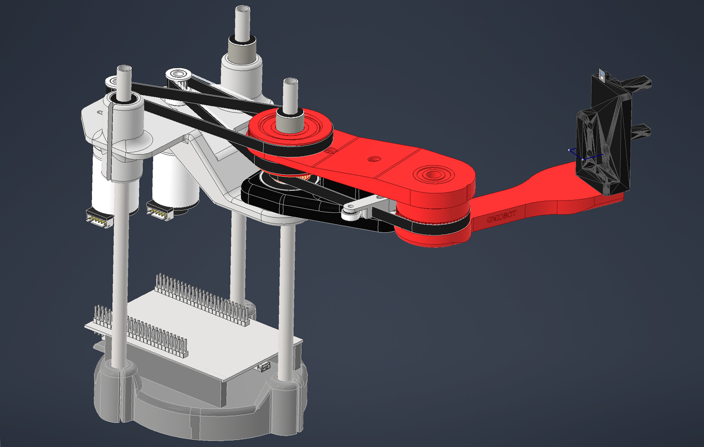
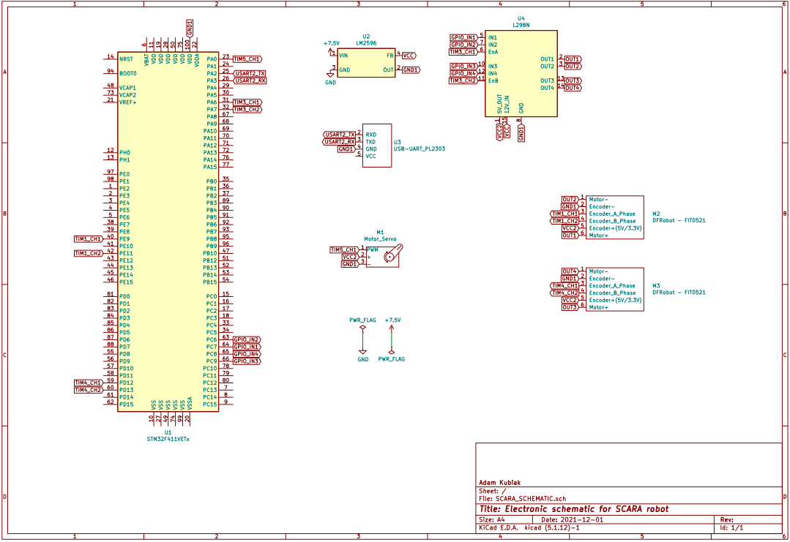

# SCARA-PROJECT
# SCARA(GNIOBOT) - DIY manipulator o trzech stopniach swobody typu SCARA :robot:

# Główne cechy projektu
## W ramach projektu zrealizowano następujące zadania:
- [X] Stworzenie trójwymiarowego modelu robota
- [X] Wykonanie modelu 3D manipulatora, gotowego pod druk 3D
- [X] Skonstruowanie manipulatora
- [X] Zaprojektowanie i wykonanie elektroniki niezbędnej do zasilania i sterowania podzespołów
- [X] Wyprowadzenie modelu kinematyki prostej i odwrotnej dla robota typu SCARA
- [X] Wykonanie programu sterującego na mikrokontroler STM32
- [X] Zaprogramowanie i dostrojenie kontrolera PID odpowiedzialnego za sterowanie silnikami DC
- [X] Stworzenie aplikacji okienkowej umożliwiającej sterowanie i obserwację położenia robota
## Sekwencja ruchów

## Rysowanie

# Aplikacja okienkowa QT
## Aplikacja pozwala na:
- [X] Sterowanie manipulatorem z wykorzystaniem kinematyki prostej oraz odwrotnej
- [X] Obserwację położenia efektora i konfiguracji przegubów
- [X] Obserwację danych sensorycznych na dedykowanych wykresach
- [X] Obserwację rzeczywistego położenia manipulatora w przestrzeni za pomocą wizuacji modelu 3D manipulatora
- [X] Tworzenie sekwencji złożonej z wcześniej zaprogramowanych przez użytkownika pozycji
- [X] Rysowanie prostych kształtów takich jak linie proste oraz okręgi 

## Diagram UML

Oprogramowanie aplikacji sterującej robotem zostało oparte i rozbudowane na podstawie mojego poprzedniego projektu:
https://github.com/AdamKubiak/WDS_Qt3D

# Model 3D
Model robota został stworzony w oprogramowaniu Autodesk Inventor.

# Elektronika
W celu zmniejszenia kosztów elektronika została wykonana na płytce prototypowej, a połaczenia układu zostały wykonane za pomocą kabli. 

